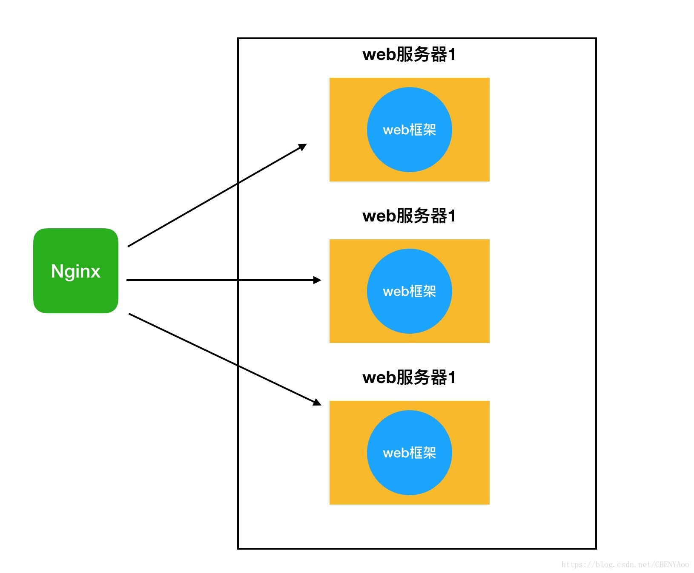

## 后端

### 开发语言

#### 备选方案

##### Python3

由于 Python 是一种解释型的脚本语言，开发效率高，所以非常适合用来做 Web 开发，不仅如此，Python 有还有上百种 Web 开发框架，有很多成熟的模板技术，不但开发效率高，而且运行速度快。

##### PHP7

PHP 是一种广泛使用的开源通用脚本语言，特别适合于 Web 开发，并且可以嵌入 HTML 中，可以非常方便地编写 HTML 模板而不用借助其它库。它上手非常简单，但为专业程序员提供了许多高级功能。

对比：

- Python 的包的管理更强大，引入新的依赖成本低。
- Python 可用的库比 PHP 更多，开发成本更低。
- PHP 可以非常方便地直接用来编写 HTML 模版，Python 需要借助其他的语言或库来实现。
- Python 的代码风格简洁易懂易于维护，而 PHP 代码在量大的情况容易混乱。

#### 最终选择

##### Python3

首先，开发小组的成员更熟悉 Python3，而且从总体看来，Python3 的可拓展性更强，功能更广，再加上 Python3 成熟的 Web 框架，可以大大降低开发成本。

### 数据库

#### 备选方案

##### MySQL

关系型数据库，支持多种操作系统包括 Linux 和 Windows，并为多种编程语言提供了API，包括 PHP、Pythonl 等。支持多线程，充分利用 CPU 资源，支持多用户。优化了 SQL 查询算法，查询效率高。历史悠久，社区和用户活跃。许可协议：GPLv2。

##### SQLite

关系型数据库，不需要配置，不需要安装和管理，不需要一个单独的服务器进程或操作的系统。SQLite 是非常小的，轻量级的数据库，完全配置好也不过是 400 KiB。可以在多种操作系统上运行。许可协议：公有领域。

##### Redis

非关系型数据库，支持数据的持久化，可以将内存中的数据保存在磁盘中，重启的时候可以再次加载进行使用。Redis 性能非常高而且不仅仅支持简单的 key-value 类型的数据，同时还提供 list，set 等数据结构的存储。许可协议：BSD。

##### MariaDB

MariaDB 是 MySQL 的分支版本。MariaDB 针对性能进行了优化，对于大型数据集，它比 MySQL 强大得多。MariaDB 为磁盘访问，连接操作，子查询，派生表和视图，执行控制甚至解释语句相关的查询应用了许多查询优化。许可协议：GPLv2。

#### 最终选择

##### MariaDB

面对我们线上答疑应用，并不需要非关系型数据库那样高的并发量，而是易于维护、使用方便、容易理解的关系型数据库。维护一致性，保证数据的持久存储，尤其是海量数据的持久存储的关系型数据库是我们的首选。最终我们选择了 MariaDB 是因为它比 MySQL 更优秀的性能，及安全性。加上 MariaDB 纯粹是开源的，而不是 MySQL 使用的双重授权模式。

### 接口

#### RESTful API

我们的应用前后端严格分离，因此我们需要一套统一的设计风格 REST。REST 是目前最流行的一种互联网软件架构。它结构清晰、符合标准、易于理解、扩展方便，所以正得到越来越多网站的采用。REST 拥有轻量（只需要 HTTP 协议）、面向资源、数据描述简单（json 格式的数据）的优点。可以说 RESTful API 目前是前后端分离的最佳实践。

### Web 开发框架

#### 备选方案

##### Django

Django 是一个开源的 Python Web 应用框架，最初是由在新闻发布公司工作的人设计的，采用了 MVT 的框架模式，即模型 M，视图 V 和模版 T，最早于 2005 年发布。Django 被认为是"大而全"的重量级 Web 框架，其自带大量的常用工具和组件（比如数据库 ORM 组件、用户认证、权限管理、分页、缓存), 甚至还自带了管理后台Admin，适合快速开发功能完善的企业级网站。Django 自带免费的数据 SQLite，同时支持 MySQL 与 PostgreSQL 等多种数据库。用 Django 开发的著名网站包括 Pinterest， Disqus， Eventbrite,，Instagram 和 Bitbucket。

Django 的路由设计是采用集中处理的方法，利用正则匹配。项目的结构布局是刚性的，开发者可以清楚地知道在APP的相应文件夹内的对应文件（media 目录，static 目录， template 目录，views.py， models.py， forms.py 等)。

##### Flask

Flask 是一个由 Python 语言写成的轻量级 Web 框架，最早由奥地利人 Armin Ronacher 于 2010 年发布。Flask 最显著的特点是它是一个“微”框架，轻便灵活，但同时又易于扩展。默认情况下，Flask 只相当于一个内核，不包含数据库抽象层（ORM）、用户认证、表单验证、发送邮件等其它 Web 框架经常包含的功能。Flask 依赖用各种灵活的扩展（比如邮件 Flask-Mail，用户认证 Flask-Login，数据库 Flask-SQLAlchemy）来给 Web 应用添加额外功能。Flask 的这种按需扩展的灵活性是很多程序员喜欢它的地方。Flask 没有指定的数据库，可以根据开发者需求自行选择。

#### 最终选择

##### Flask

Django 和 Flask 都是很优秀的框架，二者最大的区别在于设计哲学：Django 想尽量大而全，Flask 追求小巧、灵活，作为有经验的程序员，我们对于自定义的需求会更高，比如 Flask 可以依据蓝图注册不同 errorhandler/beforerequest 等钩子，十分方便，而 Django 就只能通过 middleware 勉强实现。

Django 的模块化是集成在命令里的，也就是说一开始 Django 的目标就是为以后玩大了做准备的。每个都是一个独立的模块，为以后的复用提供了便利。而 Flask 通过 Blueprint 来提供模块化，自己对项目结构划分成不同的模块进行组织。

因此，我们选择使用更简洁优雅，凸显 Pythonic 风格的 Flask。


### 插件/应用/服务

#### USTC-CAS

由于我们做答疑系统的直接目的是给科大师生使用，我们将使用 USTC 的统一认证服务，更好地管理用户权限。

#### Flake8

可以帮助分析代码库样式的错误和一致性。

#### Flask-Login

线上答疑应用需要处理来自学生和教师的身份验证，Flask-Login 就是一个非常功能非常强大的处理用户登录的插件。它可以帮助我们完成很多负责的功能例如 sessions 和 cookies 的管理

#### Flask-Mail

在我们的线上答疑应用，邮件通知是不可缺少的功能，因此我们可以使用 Flask-Mail 插件帮助我们发送基于 SMTP 的邮件。使用起来非常方便快捷。

#### Flask-RESTful

Flask-RESTful 拓展可以帮助我们快速搭建 RESTful 接口。它的优点是十分轻量，效率非常高。

#### Flask-SQLAlchemy

这是 FLask 中一个很强大的关系型数据库框架，不仅可以将数据库抽象成 ORM，还支持最底层的 SQL 语句。使用 ORM 非常有助于提高面向对象的开发效率。

#### Flask-Dropzone

在管理课程信息是，教师需要上传上传讲义等教学资源，所以我们需要添加上传文件的服务。

对于单个文件来说，使用上传字段并添加一些样式已经足够了。而如果上传多个文件，仅仅显示一个上传按钮对用户不太友好。在上传文件等待服务器返回响应的过程中，浏览器会进入临时的“挂起”状态，尤其是上传多个文件时，上传过程中页面没有任何变化，只有浏览器左下方会显示上传的进度。对于用户来说，这时候他们更希望看到一个完善的上传页面，其中包含所有选中文件的列表，以及对应的文件名和上传进度，如果是图片则可以显示一张缩略图。

我们可以借助 JavaScript 库实现在客户端实时显示文件上传状态，而且这些 JavaScript 上传库还提供了文件的客户端验证功能。常用的 JavaScript 文件上传库有 jQuery File Upload、Dropzone.js 和 Plupload 等。

[Dropzone.js](http://www.dropzonejs.com) 是一个开源的 JavaScript 上传插件，它几乎可以胜任我们上面设想的所有要求。除此之外，它还提供了拖拽上传功能，可以在客户端对文件的大小、类型进行过滤，而且有丰富的自定义选项，使用它可以让上传过程变得鲜活有趣，不至于让用户在这个过程中感到无聊。扩展 Flask-Dropzone 集成了 Dropzone.js，简化了大部分设置，并内置了对 CSRFPortect 扩展的支持。

#### Flask-WTF

扩展 Flask-WTF 集成了 WTForms，使用它可以在 Flask 中更方便地使用 WTForms。Flask-WTF 将表单数据解析、CSRF 保护、文件上传等功能与 Flask 集成，另外还附加了 reCAPTCHA 支持。

注：reCAPTCHA 是 Google 开发的免费验证码服务，在国内无法使用。

同时，博客管理后台会涉及对资源的局部更新和删除操作，这时我们就要考虑到 CSRF 保护问题。为了应对 CSRF 攻击，当需要创建、修改和删除数据时，我们需要将这类请求通过 POST 方法提交，同时在提交请求的表单中添加 CSRF 令牌。对于删除和某些修改操作来说，单独创建表单类的流程太过烦琐，我们就可以使用 Flask-WTF 内置的 CSRFProtect 扩展为这类操作实现更简单和完善的 CSRF 保护。

#### SendGrid

在生产环境下，除了自己安装运行邮件服务器外，更方便的做法是使用事务邮件服务（Transactional Email Service），比如 [Mailgun](https://www.mailgun.com/)、[Sendgrid](https://sendgrid.com/) 等。这两个邮件服务对免费账户分别提供每月 1 万封和 3000 封的免费额度，完全足够测试使用或在小型程序中使用。我们将使用 SendGrid 来发送电子邮件。

除了提供 SMTP 转发，SendGrid 还支持通过它提供的 Web API 转发邮件。和使用 SMTP 服务器发送邮件相比，使用 Web API 发送邮件更安全，而且省去了建立 SMTP 连接的繁琐过程，因此速度更快，尤其是需要发送大批量邮件的情况下。尽管如此，如果你想让程序更容易迁移，更关注灵活性，那么也可以选择使用更通用的 SMTP，这时当需要更换邮件服务时只需要替换配置信息即可。

#### Faker

创建虚拟数据是编写 Web 程序时的常见需求。在简单的场景下，我们可以手动创建一些虚拟数据，但更方便的选择是使用第三方库实现。流行的 Python 虚拟数据生成工具有 [Mimesis](https://github.com/lk-geimfari/mimesis) 和 Faker，后者同时支持 Python2 和 Python3，而且文档中包含丰富的示例，所以这里将选用 Faker。

#### Flask-DebugToolbar

扩展 Flask-DebugToolbar 提供了一系列调试功能，可以用来查看请求的 SQL 语句、配置选项、资源加载情况等信息，这些是在开发测试过程中非常便捷的功能。

#### Flask-Avatars

在答疑社区中，用户需要有自己的头像，我们使用 Flask-Avatars 来实现用户头像的管理功能。

#### Flask-Whooshee

对于答疑社区网站来说，搜索功能必不可少。学生用户使用搜索功能搜索相应的关键词会节省大量摸索的时间。

大多数数据库引擎本身提供了全文搜索功能，但是如果某一天我们想要更换数据库引擎，这些功能就需要重新实现。我们需要的是不局限于某个数据库引擎的搜索引擎，而且最好能够和 SQLAlchemy 相集成。另外，我们还要考虑到 Flask 扩展的支持情况，以及对 Python3 的支持情况。基于这些考虑，我们最终选择了纯 Python 编写的 Whoosh，并通过集成 Whoosh 的 Flask 扩展 Flask-Whooee 来实现全文搜索。

#### Flask-SocketIO

当某个用户在答疑评论区中发送一条消息时，访问该界面的所有用户都会收到这条消息。

在以前，Web 应用的实时通信或实时推送大多是通过轮询（Polling）来模拟实现的，但无论是传统轮询，还是性能更佳的长轮询，这些方式大都会造成带宽或是服务器资源上的浪费，增加服务器的负担。虽然 SSE 可以实现服务器端推送，但却需要在客户端配合使用 AJAX 才能模拟双向通信。总之，这些技术都存在一定的局限性。

WebSocket 的出现改变了这一切。WebSocket 是 HTML5 中定义的可以在单个 TCP 连接上进行双向通信（即全双工通信）的协议。它的出现解决了以往使用轮询技术所造成的服务器资源和带宽的浪费，实现了真正的实时双向通信。借助 WebSocket，浏览器和服务器只需要完成一次握手（handshaking），两者就可以建立持久的连接，并进行双向数据传输。

#### Flask-Caching

在 Web 程序中，加速程序响应时间的最简单和有效的方法就是使用缓存。如果没有设置缓存，那么用户访问某个页面 N 次，服务器就要调用对应的视图函数 N 次。这就意味着会执行N次数据库查询、N 次函数计算和 N 次模板渲染。如果我们在用户第一次访问时把调用视图函数的返回值缓存起来，那么用户后续的访问会直接使用缓存的数据，这样我们就不需要重复执行数据库查询、函数计算和模板渲染等工作。我们使用 Flask-Caching 来实现缓存机制。

#### Flask-Assets

在服务器端加入缓存系统后，程序的响应速度会有非常明显地提升。但是对于客户端，我们还有一些优化工作要做。当页面被加载时，除了页面本身，同时被加载的还有页面中被引用的文件，每一个文件都会触发一个 HTTP 请求。除了 HTML 页面和 Favicon，其中还包括多个 JavaScript 文件和 CSS 文件，同时下载大量文件必然会带来性能问题。在部署时我们一般会采取租用 CDN 服务（开源 JavaScript 库和 CSS 库各大 CDN 提供商会免费提供）或是用设立独立的静态资源服务器的方式进行优化，在此之前，我们可以在程序中使用 Flask-Assets 对这些资源进行预处理。

#### Werkzeug

Werkzeug 是 Flask 的主要依赖，是非常优秀的 WSGI 工具库，我们会在部署部分再提到它。

在生产环节中，尽管对密码加密存储安全性很强，我们仍然需要使用安全的 HTTP 以加密传输数据，避免密码在传输过程中被截获。因为这些工作太过复杂，而且容易出错，所以我们还是把生成和验证密码散列值的工作交给第三方库，常用的计算密码散列值的 Python 库有 [PassLib](http://bitbucket.org/ecollins/passlib)、[bcrybt](https://github.com/pyca/bcrypt) 等， Werkzeug 也提供了这一功能。

## 部署

### 概述

Web 软件对于请求的操作流程往往是分层处理的：从客户端发送一个 HTTP 请求，到 Flask 处理请求，分别经过了 Web 服务器层，WSGI 层和 Web 开发框架层。不同的层次对应作用有很大差异，下面简要介绍各层的作用。

#### Web 服务器层

对于传统的客户端 - 服务器架构，其请求的处理过程是，客户端向服务器发送请求，服务器接收请求并处理请求，然后给客户端返回响应。在这个过程中，服务器的作用是：

1. 接收请求
2. 处理请求
3. 返回响应

Web 服务器是一类特殊的服务器，其作用是主要是接收 HTTP 请求并返回响应，常见的 Web服务器有 Nginx，Apache，IIS 等。在三层结构中，Web 服务器是最先接收用户请求的，并会在处理后将响应结果返回给用户。

在开发时，我们使用 flask run 命令启动的开发服务器是由 Werkzeug 提供的。细分的话，Werkzeug 提供的这个开发服务器应该被称为 WSGI 服务器，而不是单纯意义上的 Web 服务器。在生产环境中，我们需要一个更强健、性能更高的 WSGI 服务器。这些 WSGI 服务器也被称为独立 WSGI 容器（Standalone WSGI Container），因为它们可以承载我们编写的 WSGI 程序，然后处理 HTTP 请求和响应。这通常有很多选择，比如 Gunicorn、uWSGI、Gevent、Waitress 等。通常我们会根据程序的特点来选择，比如，对于一个小型的个人博客，使用 Gevent 就足够了。主流的选择是使用 unicorn 和 uWSGI。在这里我们将使用 Gunicorn，它使用起来相对简单，容易配置，而且性能优秀。

##### 代理服务

一个普通的个人网站，访问量不大的话，当然可以由 uWSGI 和 Django 构成。但是一旦访问量过大，客户端请求连接就要进行长时间的等待。这个时候就出来了分布式服务器，我们可以设置多台 Web 服务器，都能处理请求。这时候就需要 分配请求，达到负载均衡，因为我们上面使用了Gunicorn，所以这里选择使用和 Gunicorn 集成良好的 Nginx 实现反向代理，如下图所示。



#### Web 开发框架层

Web 框架的作用主要是方便我们开发 Web 应用程序，HTTP 请求的动态数据就是由 Web 框架层来提供的。常见的 Web 框架有 Flask，Django 等，我们以将要使用的 Flask 框架为例，通过最简单的 Demo 展示 Web框架层的作用：

```python
from flask import Flask
app = Flask(__name__)

@app.route('/hello')
def hello_world():
    return 'Hello World!'

if __name__ == '__main__':
    app.run(host='0.0.0.0', port=8080)
```

以上的几行代码，就创建了一个 Web 应用程序对象 app。app 监听机器所有 ip 的 8080 端口，接受用户的请求连接。我们知道，HTTP 协议使用 URL 来定位资源，上面的程序会将路径 /hello 的请求交由 hello_world 方法处理，hello_world 返回 ‘Hello World!’ 字符串。Web 框架的使用者并不关心如何接收 HTTP 请求，也不关心如何将请求路由到具体方法处理并将响应结果返回给用户，在大部分情况下，他们只需要关心如何实现业务的逻辑。

#### WSGI层

WSGI 不是服务器，也不是用于与程序交互的 API，它只是一种接口，且只适用于 Python 语言。其全称为 Web Server Gateway Interface，定义了 Web 服务器和 Web 应用之间的接口规范。也就是说，只要 Web 服务器和 Web 应用都遵守 WSGI 协议，那么 Web 服务器和 Web 应用就可以随意组合。
下面的代码展示了 Web 服务器是如何与 Web 应用组合在一起的。

```Python
def application(env, start_response):
    start_response('200 OK', [('Content-Type', 'text/html')])
    return [b"Hello World"]
```

方法 application 由 Web 服务器调用，参数 env，start_response 由 Web 服务器传入。其中，env 是一个字典，包含了类似 HTTP_HOST，HOST_USER_AGENT，SERVER_PROTOCO 等环境变量。

start_response 则是一个方法，该方法接受两个参数，分别是 status，response_headers。application 方法的主要作用是，设置 HTTP 响应的状态码和 Content-Type 等头部信息，并返回响应的具体结果。

上述代码就是一个完整的 WSGI 应用，当一个支持 WSGI 的 Web 服务器接收到客户端的请求后，便会调用这个 application 方法。WSGI 层并不需要关心 env，start_response 这两个变量是如何实现的，就像在 application 里面所做的，直接使用这两个变量即可。

值得指出的是，WSGI 是一种协议，uWSGI 也一样是一种协议，而 uwsgi 是实现了 uWSGI 和 WSGI 两种协议的 Web 服务器。

##### CGI

CGI 是一种通用网关接口，并不限于 Python 语言，定义了 Web 服务器是如何向客户端提供动态的内容。例如，规定了客户端如何将参数传递给 Web 服务器，Web 服务器如何将参数传递给 Web 应用，Web 应用如何将它的输出如何发送给客户端等等。

生产环境下的 Web 应用已经很少使用 CGI 了，CGI 进程（类似 Python 解释器）针对每个请求创建，用完就抛弃，效率低下。所以我们选择了 WSGI。
