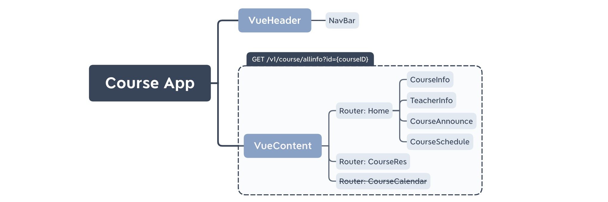

# 2020-05-09-前后端API协商

记录者：金哲欣

参与者：李缙、金哲欣、林焕承、宁雨亭、王顺洪、许世晨、张俸铭、左顺

## 课程主页界面 Course App

### 1. 组件架构



### 2. API

#### 获取课程全部信息

请求：

```
GET /v1/course/allinfo?id={courseID}
```

返回：

```javascript
{
    "code": Number, // 0 is OK, otherwise bad
    "msg": String,  // successful msg or faild msg 
    "data": {
        "name": String,
        "intro": String,
        "teachers": [
            {
                "name": String,
                "email": String,
                "phone": String
            }
        ],
        "assistants": [
            {
                "name": String,
                "email": String,
                "phone": String
            }
        ],
      	"announces": [
            {
                "title": String,
                "publisher": String,
                "date": Date,
                "content": String
            }
        ],
        "schedule": [
            {
                "weekId": Number,
                "courses": [
                    {
                        "topic": String,
                        "reference": String
                        // add other fileds here
                    }
                ],
                "assignments": [
                    {
                        "title": String,
                        "due": Date
                    }
                ]
            }
        ],
        "resources": [
            {
                "title": String,
                "date": Date,
                "content": String,
                "attachments": [
                    {
                        "name": String,
                        "downloadLink": String
                    }
                ]
            }
        ],
        "semesters": [
            {
                "name": String,
                "link": String
            }
        ],
        "proansLink": String
    } 
}
```

## 课程答疑界面 Proans App

### 1. 组件架构


### 2. GET API

#### 获取课程问题分类

请求：

```
GET /v1/proans/categories?id={proansID}
```

返回：

```javascript
{
    "code": Number, // 0 is OK, otherwise bad
    "msg": String,  // successful msg or faild msg 
    "data": {
        "categories": [
            {
                "id": String,
                "name": String,
            }
        ]
    }
}
```

#### 获取所有分类下的全部问题列表

请求：

```
GET /v1/proans/problems?id={proansID}
```

返回：

```javascript
{
    "code": Number, // 0 is OK, otherwise bad
    "msg": String,  // successful msg or faild msg 
    "data": {
        "problems": [
            {
                "id": String,
                "title": String,
                "content": String
            }
        ]
    }
}
```

#### 获取某个问题分类下的问题列表

请求：

```
GET /v1/proans/problems?id={proansID}&category={categoryID}
```

返回：

```javascript
{
    "code": Number, // 0 is OK, otherwise bad
    "msg": String,  // successful msg or faild msg 
    "data": {
        "problems": [
            {
                "id": String,
                "title": String,
                "content": String
            }
        ]
    }
}
```

#### 获取某个问题的详细描述

请求：

```
GET /v1/proans/problem/detail?id={proansID}&problem={problemID}
```

返回：

```javascript
{
    "code": Number, // 0 is OK, otherwise bad
    "msg": String,  // successful msg or faild msg 
    "data": {
        "problem": {
            "id": String,
            "title": String,
            "content": String,
            "tags": [String],
            "stared": Boolean,    // 点赞
            "packed": Boolean    // 关注
        }
    }
}
```

#### 获取某个问题的教师、助教答案

请求：

```
GET /v1/proans/answer/teacher?id={proansID}&problem={problemID}
```

返回：

```javascript
{
    "code": Number, // 0 is OK, otherwise bad
    "msg": String,  // successful msg or faild msg 
    "data": {
        "answer": {
            "id": String,
            "content": String,
            "stared": Boolean
        }
    }
}
```

#### 获取某个问题的学生答案

请求：

```
GET /v1/proans/answer/student?id={proansID}&problem={problemID}
```

返回：

```javascript
{
    "code": Number, // 0 is OK, otherwise bad
    "msg": String,  // successful msg or faild msg 
    "data": {
        "answer": {
            "id": String,
            "content": String,
            "stared": Boolean
        }
    }
}
```

#### 获取某个问题的讨论

请求：

```
GET /v1/proans/discussions?id={proansID}&problem={problemID}
```

返回：

```javascript
{
    "code": Number, // 0 is OK, otherwise bad
    "msg": String,  // successful msg or faild msg 
    "data": {
        "discussions": [
            {
                "id": String,
                "username": String,
                "date": Date,
                "content": String,
                "comments": [
                    {
                        "id": String,
                        "username": String,
                        "date": Date,
                        "content": String
                    }
                ]
            }
        ]
    }
}
```

#### 点赞某个问题

请求：

```
POST /v1/proans/problem/star
Content-Type: application/json

{
	"id": {proansID},
	"problem": {problemID}
}
```

返回：

```
http.status === 200 ? 'successful' : 'failed'

if failed, return following json data
{
	"code": Number,
	"msg": String
}
```

#### 点赞某个老师、助教回答

请求：

```
POST /v1/proans/answer/teacher/star
Content-Type: application/json

{
	"id": {proansID},
	"problem": {problemID}
}
```

返回：

```
http.status === 200 ? 'successful' : 'failed'

if failed, return following json data
{
	"code": Number,
	"msg": String
}
```

#### 点赞某个学生回答

请求：

```
POST /v1/proans/answer/student/star
Content-Type: application/json

{
	"id": {proansID},
	"problem": {problemID}
}
```

返回：

```
http.status === 200 ? 'successful' : 'failed'

if failed, return following json data
{
	"code": Number,
	"msg": String
}
```

#### 关注某个问题

请求：

```
POST /v1/proans/problem/follow
Content-Type: application/json

{
	"id": {proansID},
	"problem": {problemID}
}
```

返回：

```
http.status === 200 ? 'successful' : 'failed'

if failed, return following json data
{
	"code": Number,
	"msg": String
}
```

#### 编辑某个问题

请求：

```
POST /v1/proans/problem/edit
Content-Type: application/json

{
	"id": {proansID},
	"problem": {problemID},
	"content": String
}
```

返回：

```
http.status === 200 ? 'successful' : 'failed'

if failed, return following json data
{
	"code": Number,
	"msg": String
}
```

#### 点赞某个老师、助教回答

请求：

```
POST /v1/proans/answer/student/edit
Content-Type: application/json

{
	"id": {proansID},
	"problem": {problemID},
	"content": String
}
```

返回：

```
http.status === 200 ? 'successful' : 'failed'

if failed, return following json data
{
	"code": Number,
	"msg": String
}
```

#### 发布新的讨论

请求：

```
POST /v1/proans/discussion/publish
Content-Type: application/json

{
	"id": {proansID},
	"problem": {problemID},
	"content": String
}
```

返回：

```
http.status === 200 ? 'successful' : 'failed'

if failed, return following json data
{
	"code": Number,
	"msg": String
}
```

#### 对讨论进行评论

请求：

```
POST /v1/proans/discussion/comment
Content-Type: application/json

{
	"id": {proansID},
	"problem": {problemID},
	"discussion": {discussionID},
	"content": String
}
```

返回：

```
http.status === 200 ? 'successful' : 'failed'

if failed, return following json data
{
	"code": Number,
	"msg": String
}
```


## 后台管理界面 Admin App

### 1. 组件架构


### 2. GET API

#### 管理员获取课程列表

请求：

```
GET /v1/admin/admin/course-list
```

返回：

```javascript
{
    "code": Number, // 0 is OK, otherwise bad
    "msg": String,  // successful msg or faild msg 
    "data": {
        "courses": [
            {
                "courseName": String,
                "teacherName": String,
                "id": String
            }
        ]
    }
}
```

#### 管理员获取教师列表

请求：

```
GET /v1/admin/admin/teacher-list
```

返回：

```javascript
{
    "code": Number, // 0 is OK, otherwise bad
    "msg": String,  // successful msg or faild msg 
    "data": {
        "teachers": [
            {
                "name": String,
                "id": String,
                "email": String,
                "phone": String,
                "academy": String,
            }
        ]
    }
}
```

#### 管理员获取学生列表

请求：

```
GET /v1/admin/admin/student-list
```

返回：

```javascript
{
    "code": Number, // 0 is OK, otherwise bad
    "msg": String,  // successful msg or faild msg 
    "data": {
        "teachers": [
            {
                "name": String,
                "id": String,
                "email": String,
                "phone": String,
            }
        ]
    }
}
```

#### 教师获取课程列表

请求：

```
GET /v1/admin/teacher/course-list
```

返回：

```javascript
{
    "code": Number, // 0 is OK, otherwise bad
    "msg": String,  // successful msg or faild msg 
    "data": {
        "courses": [
            {
                "id": String,
                "name": String
            }
        ]
    }
}
```

#### 教师获取学期列表

请求：

```
GET /v1/admin/teacher/semester-list?course={courseID}
```

返回：

```javascript
{
    "code": Number, // 0 is OK, otherwise bad
    "msg": String,  // successful msg or faild msg 
    "data": {
        "semesters": [
            {
                "id": String,
                "name": String
            }
        ]
    }
}
```

#### 教师获取某一课程某一学期的所有数据

请求：

```
GET /v1/admin/teacher/course/allinfo?course={courseID}&semester={semesterID}
```

返回：

```javascript
{
    "code": Number, // 0 is OK, otherwise bad
    "msg": String,  // successful msg or faild msg 
    "data": {
        "name": String,
        "intro": String,
        "teachers": [
            {
              	"id": String,
                "name": String,
                "email": String,
                "phone": String
            }
        ],
        "assistants": [
            {
              	"id": String,
                "name": String,
                "email": String,
                "phone": String
            }
        ],
        "students": [
            {
              	"id": String,
                "name": String,
                "email": String,
                "phone": String
            }
        ],
      	"announces": [
            {
                "title": String,
                "publisher": String,
                "date": Date,
                "content": String
            }
        ],
        "schedule": [
            {
                "weekId": Number,
                "courses": [
                    {
                        "topic": String,
                        "reference": String
                    }
                ],
                "assignments": [
                    {
                        "title": String,
                        "due": Date
                    }
                ]
            }
        ],
        "resources": [
            {
                "title": String,
                "date": Date,
                "content": String,
                "attachments": [
                    {
                        "name": String,
                        "downloadLink": String
                    }
                ]
            }
        ]
    }
}
```

#### 管理员开设课程

请求：

```
POST /v1/admin/admin/course/add
Content-Type: application/json

{
	"id": {adminID},
	"course": {
		"title": String,
		"teacher": String
	}
}
```

返回：

```
http.status === 200 ? 'successful' : 'failed'

if failed, return following json data
{
	"code": Number,
	"msg": String
}
```

#### 管理员注销课程

请求：

```
POST /v1/admin/admin/course/delete
Content-Type: application/json

{
	"id": {adminID},
	"course": {courseID}
}
```

返回：

```
http.status === 200 ? 'successful' : 'failed'

if failed, return following json data
{
	"code": Number,
	"msg": String
}
```

#### 管理员注册新教师

请求：

```
POST /v1/admin/admin/teacher/add
Content-Type: application/json

{
	"id": {adminID},
	"teacher": {
		"name": String,
		"ID": String,
		"emial": String,
		"phone": String,
		"academy": String
	}
}
```

返回：

```
http.status === 200 ? 'successful' : 'failed'

if failed, return following json data
{
	"code": Number,
	"msg": String
}
```

#### 管理员注销教师

请求：

```
POST /v1/admin/admin/teacher/delete
Content-Type: application/json

{
	"id": {adminID},
	"teacher": {teacherID}
}
```

返回：

```
http.status === 200 ? 'successful' : 'failed'

if failed, return following json data
{
	"code": Number,
	"msg": String
}
```

#### 管理员注册新学生

请求：

```
POST /v1/admin/admin/student/add
Content-Type: application/json

{
	"id": {adminID},
	"student": {
		"name": String,
		"ID": String,
		"emial": String,
		"phone": String,
		"academy": String
	}
}
```

返回：

```
http.status === 200 ? 'successful' : 'failed'

if failed, return following json data
{
	"code": Number,
	"msg": String
}
```

#### 管理员注销学生

请求：

```
POST /v1/admin/admin/student/delete
Content-Type: application/json

{
	"id": {adminID},
	"student": {studentID}
}
```

返回：

```
http.status === 200 ? 'successful' : 'failed'

if failed, return following json data
{
	"code": Number,
	"msg": String
}
```

#### 老师添加助教

请求：

```
POST /v1/admin/teacher/assistant/add
Content-Type: application/json

{
	"id": {teacherID},
	"assistant": {
		"name": String,
		"id": String,
		"email": String,
		"phone": String
	}
}
```

返回：

```
http.status === 200 ? 'successful' : 'failed'

if failed, return following json data
{
	"code": Number,
	"msg": String
}
```

#### 老师删除助教

请求：

```
POST /v1/admin/teacher/assistant/delete
Content-Type: application/json

{
	"id": {teacherID},
	"assistant": {assistantID}
}
```

返回：

```
http.status === 200 ? 'successful' : 'failed'

if failed, return following json data
{
	"code": Number,
	"msg": String
}
```

#### 老师添加学生

请求：

```
POST /v1/admin/teacher/student/add
Content-Type: application/json

{
	"id": {teacherID},
	"student": {
		"name": String,
		"id": String,
		"email": String,
		"phone": String
	}
}
```

返回：

```
http.status === 200 ? 'successful' : 'failed'

if failed, return following json data
{
	"code": Number,
	"msg": String
}
```

#### 老师删除助教

请求：

```
POST /v1/admin/teacher/student/delete
Content-Type: application/json

{
	"id": {teacherID},
	"student": {studentID}
}
```

返回：

```
http.status === 200 ? 'successful' : 'failed'

if failed, return following json data
{
	"code": Number,
	"msg": String
}
```

#### 老师添加课程简介

请求：

```
POST /v1/admin/teacher/intro/add
Content-Type: application/json

{
	"id": {teacherID},
	"intro": {
		"teacherInfo": String,
		"classTime": String,
		"content": String
	}
}
```

返回：

```
http.status === 200 ? 'successful' : 'failed'

if failed, return following json data
{
	"code": Number,
	"msg": String
}
```

#### 老师添加课程公告

请求：

```
POST /v1/admin/teacher/announce/add
Content-Type: application/json

{
	"id": {teacherID},
	"announce": {
		"title": String,
		"content": String
	}
}
```

返回：

```
http.status === 200 ? 'successful' : 'failed'

if failed, return following json data
{
	"code": Number,
	"msg": String
}
```

#### 老师编辑课程公告

请求：

```
POST /v1/admin/teacher/announce/edit
Content-Type: application/json

{
	"id": {teacherID},
	"announce": {
		"id": {announceID}
		"title": String,
		"content": String
	}
}
```

返回：

```
http.status === 200 ? 'successful' : 'failed'

if failed, return following json data
{
	"code": Number,
	"msg": String
}
```

#### 老师编辑老师信息

请求：

```
POST /v1/admin/teacher/teacher/edit
Content-Type: application/json

{
	"id": {teacherID},
	"teacher": {
		"id": {teacherID}
		"name": String,
		"email": String,
		"phone": String
	}
}
```

返回：

```
http.status === 200 ? 'successful' : 'failed'

if failed, return following json data
{
	"code": Number,
	"msg": String
}
```

#### 老师删除老师信息

请求：

```
POST /v1/admin/teacher/teacher/delete
Content-Type: application/json

{
	"id": {teacherID},
	"teacher": {teacherID}
}
```

返回：

```
http.status === 200 ? 'successful' : 'failed'

if failed, return following json data
{
	"code": Number,
	"msg": String
}
```

#### 老师添加课程作业

请求：

```
POST /v1/admin/teacher/homework/add
Content-Type: application/json

{
	"id": {teacherID},
	"homework": {
		"title": String,
		"content": String,
		"deadline": Date
	}
}
```

返回：

```
http.status === 200 ? 'successful' : 'failed'

if failed, return following json data
{
	"code": Number,
	"msg": String
}
```

#### 老师添加课程资源

请求：

```
POST /v1/admin/teacher/resource/add
Content-Type: application/json

{
	"id": {teacherID},
	"resource": {
		"title": String,
		"content": String
	}
}
```

返回：

```
http.status === 200 ? 'successful' : 'failed'

if failed, return following json data
{
	"code": Number,
	"msg": String
}
```

