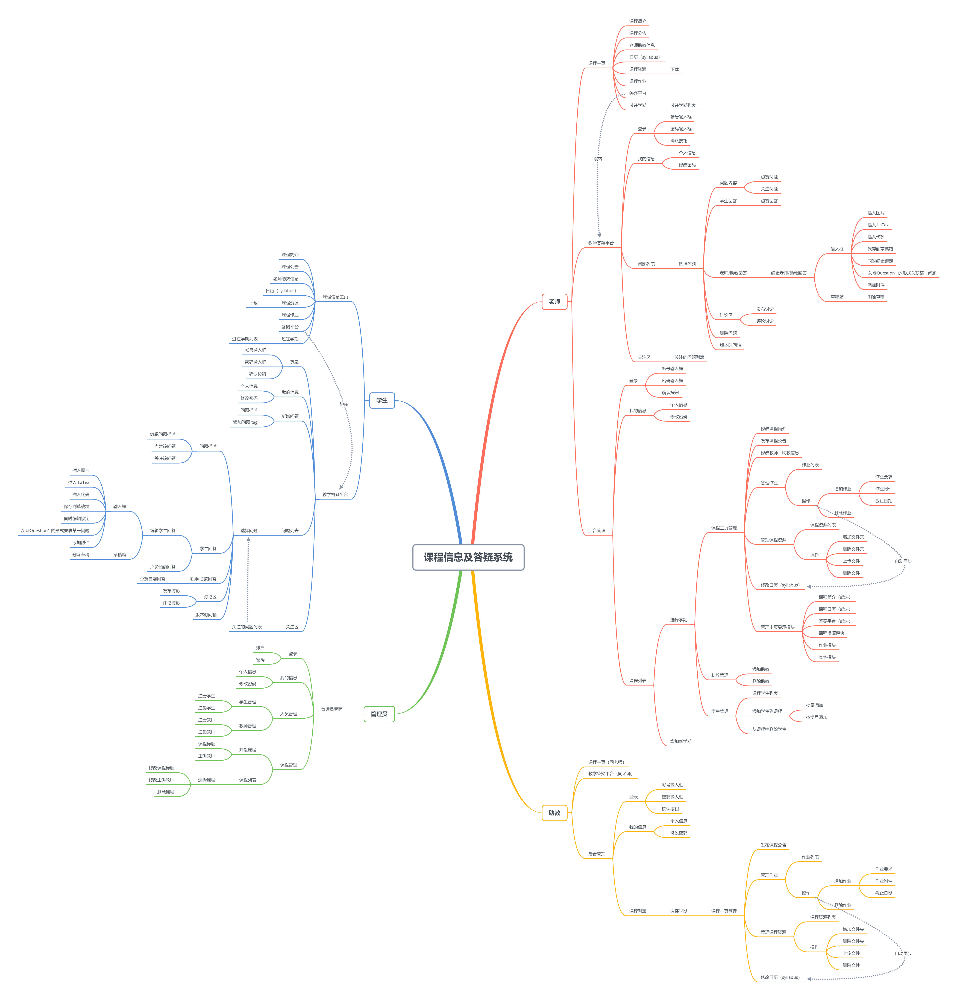

# 脑图及用户故事

## 结构梳理脑图

## 故事梳理脑图

## 用户故事 学生

### 主页

#### 学生进入课程主页

1. 学生输入 `URL` 进入主页
2. 系统显示主页

#### 学生下载资源

1. 学生进入主页后，在资源区点击相应文件
2. 系统返回对应文件

### 答疑平台

#### 学生登录教学答疑平台

1. 学生通过 `URL` 打开课程主页
2. 系统显示课程主页
3. 学生点击答疑平台
4. 系统显示登录页面
5. 学生输入账号
6. 系统显示输入的账号
7. 学生输入密码
8. 系统使用“*”显示输入的密码
9. 学生点击登录页面上的 “登录” 按钮
10. 系统提示登录成功，显示答疑平台界面

#### 学生修改密码

1. 学生在答疑平台界面点击“我的信息”
2. 系统显示账号信息
3. 学生点击“修改密码”按钮
4. 系统提示学生输入当前密码以及两遍新密码
5. 学生输入当前密码及两遍新密码
6. 系统使用“*”显示输入的密码
7. 学生点击“确认修改”按钮
8. 系统显示密码修改成功并要求学生重新登录

#### 学生查看问题

1. 学生在答疑平台界面选择问题列表中的某一问题
2. 系统显示对应问题的详细描述以及已编辑的答案

#### 学生关注问题

1. 学生在答疑平台界面选择问题列表中的某一问题
2. 系统显示对应问题的详细描述以及已编辑的答案
3. 学生点击“关注该问题”按钮
4. 系统提示已关注

#### 学生查看自己已关注的问题

1. 学生在答疑平台界面选择“关注区”标签
2. 系统显示已关注的问题列表

#### 学生获得已关注的问题的更新提醒

1. 问题增加了新的回答或讨论
2. 系统发邮件给关注了该问题的全部用户

#### 学生点赞问题

1. 学生在答疑平台界面选择问题列表中的某一问题
2. 系统显示对应问题的详细描述以及已编辑的答案
3. 学生点击“点赞该问题”按钮
4. “点赞该问题”按钮变成红色，点赞人数加一

#### 学生点赞回答

1. 学生在答疑平台界面选择问题列表中的某一问题
2. 系统显示对应问题的详细描述以及已编辑的答案
3. 学生点击某一回答的“点赞该答案”按钮
4. 对应的“点赞该答案”按钮变成红色，点赞人数加一

#### 学生编辑问题答案

1. 学生 A 在答疑平台界面选择问题列表中的某一问题
2. 系统显示对应问题的详细描述以及已编辑的答案
3. 学生 A 点击“编辑”按钮
4. 系统进入回答编辑界面，同时锁定编辑功能
5. 学生 B 进入相同问题的编辑界面
6. 系统显示：学生 A 正在编辑，已锁定
7. 学生 A 编辑问题回答
8. 系统实时显示学生 A 编辑的内容
   1. 学生 A 停止编辑 3 分钟且未确定，系统保存草稿，取消锁定
   2. 学生 A 点击“确定”按钮，系统提示问题答案编辑成功，显示更新后的问题界面

#### 学生发表问题评论

1. 学生在答疑平台界面选择问题列表中的某一问题
2. 系统显示对应问题的详细描述以及已编辑的答案
3. 学生点击评论区的“发表评论”按钮或者点击某一评论的“回复”按钮
4. 系统进入评论编辑界面
5. 学生编辑评论
6. 系统在输入框中显示学生输入的内容
7. 学生点击“确定”按钮
8. 系统提示发表成功，显示更新后的评论区

#### 学生查看并回滚答案历史

1. 学生在答疑平台界面选择问题列表中的某一问题
2. 系统显示对应问题的详细描述以及已编辑的答案
3. 学生点击“版本时间轴”按钮
4. 系统显示该问题的修改历史时间轴
5. 学生点击某一版本
6. 系统显示该版本的问题详细描述及答案
7. 学生点击“回滚到此版本”按钮
8. 系统弹出回滚确认，并要求编辑回滚理由
9. 学生编写理由后，点击“确定”按钮
10. 系统提示问题回滚成功，显示更新后的问题界面

## 用户故事 老师/助教

### 后台管理系统

> **说明：**从此处开始到下一个说明的部分中，助教权限同老师一致，故关于`老师`的用户故事均可替换为`助教`

#### 老师登录后台管理系统

1. 老师通过`URL`打开后台管理系统
2. 系统显示登录页面
3. 老师输入账号
4. 系统显示输入的账号
5. 老师输入密码
6. 系统使用“*”显示输入的密码
7. 老师点击登陆页面上的 “登录” 按钮
8. 系统提示登录成功，显示后台管理页面

#### 老师修改密码

1. 老师在后台管理页面点击“我的信息”
2. 系统显示账号信息

3. 老师点击“修改密码”按钮
4. 系统提示老师输入当前密码以及两遍新密码
5. 老师输入当前密码及两遍新密码
6. 系统使用“*”显示输入的密码
7. 老师点击“确认修改”按钮
8. 系统显示密码修改成功并要求老师重新登录

#### 老师发布课程公告

1. 老师在后台管理页面中点击课程
2. 系统显示相应课程的学期列表
3. 老师选择学期
4. 系统显示对应学期课程的管理页面
5. 老师点击“课程公告”
6. 系统显示当前课程的公告列表
7. 老师点击“新增公告”
8. 系统进入公告编辑界面
9. 老师进行编辑
10. 老师点击“发布”按钮
11. 系统提示发布成功，显示更新后的公告列表

#### 老师修改课程公告

1. 老师在后台管理页面中点击课程
2. 系统显示相应课程的学期列表
3. 老师选择学期
4. 系统显示对应学期课程的管理页面
5. 老师点击“课程公告”
6. 系统显示当前课程的公告列表
7. 老师点击某一公告的修改按钮
8. 系统进入公告编辑界面
9. 老师进行编辑
10. 老师点击“发布”按钮
11. 系统提示发布成功，显示更新后的公告列表

#### 老师删除课程公告

1. 老师在后台管理页面中点击课程
2. 系统显示相应课程的学期列表
3. 老师选择学期
4. 系统显示对应学期课程的管理页面
5. 老师点击“课程公告”
6. 系统显示当前课程的公告列表
7. 老师点击某一公告的删除按钮
8. 系统询问老师是否删除该公告
9. 老师点击“确认删除”按钮
10. 系统提示删除成功，显示更新后的公告列表

#### 老师发布作业

1. 老师在后台管理页面中点击课程
2. 系统显示相应课程的学期列表
3. 老师选择学期
4. 系统显示对应学期课程的管理页面
5. 老师点击“作业管理”
6. 系统显示当前课程的作业列表
7. 老师点击“新增作业”
8. 系统进入作业编辑界面
9. 老师进行编辑
10. 老师点击“发布”按钮
11. 系统提示发布成功，显示更新后的作业列表

#### 老师删除作业

1. 老师在后台管理页面中点击课程
2. 系统显示相应课程的学期列表
3. 老师选择学期
4. 系统显示对应学期课程的管理页面
5. 老师点击“作业管理”
6. 系统显示当前课程的作业列表
7. 老师点击某一作业的删除按钮
8. 系统询问老师是否删除该作业
9. 老师点击“确认删除”按钮
10. 系统提示删除成功，显示更新后的作业列表

#### 老师上传课程资源

1. 老师在后台管理页面中点击课程
2. 系统显示相应课程的学期列表
3. 老师选择学期
4. 系统显示对应学期课程的管理页面
5. 老师点击“课程资源管理”
6. 系统显示当前课程的课程资源列表
7. 老师点击“上传资源”
8. 系统显示文件选择框
9. 老师选择本地文件进行上传
10. 系统显示文件上传成功并提示老师添加资源描述信息
11. 老师编辑资源描述信息并点击“确定”按钮
12. 系统提示上传成功，显示更新后的课程资源列表

#### 老师删除课程资源

1. 老师在后台管理页面中点击课程
2. 系统显示相应课程的学期列表
3. 老师选择学期
4. 系统显示对应学期课程的管理页面
5. 老师点击“课程资源管理”
6. 系统显示当前课程的课程资源列表
7. 老师点击某一资源的删除按钮
8. 系统询问老师是否删除该资源
9. 老师点击“确认删除”按钮
10. 系统提示删除成功，显示更新后的课程资源列表

#### 老师修改课程日历

1. 老师在后台管理页面中点击课程
2. 系统显示相应课程的学期列表
3. 老师选择学期
4. 系统显示对应学期课程的管理页面
5. 老师点击“课程日历管理”
6. 系统显示当前课程的课程日历
7. 老师点击“编辑”按钮
8. 系统进入课程日历编辑界面
9. 老师直接在课程日历的表格中修改信息
10. 系统显示老师修改的信息
11. 老师点击“保存”按钮
12. 系统提示保存成功，显示更新后的课程日历

> **说明：**从此处开始，用户故事仅以老师为主体

#### 老师修改课程信息

1. 老师在后台管理页面中点击课程
2. 系统显示相应课程的学期列表
3. 老师选择学期
4. 系统显示对应学期课程的管理页面
5. 老师点击“课程信息”
6. 系统显示相应课程的课程信息
7. 老师点击“编辑”按钮
8. 系统进入课程信息编辑界面
9. 老师进行修改
10. 老师点击“保存”按钮
11. 系统提示修改成功，显示更新后的课程信息

#### 老师修改教师、助教信息

1. 老师在后台管理页面中点击课程
2. 系统显示相应课程的学期列表
3. 老师选择学期
4. 系统显示对应学期课程的管理页面
5. 老师点击“教师及助教信息”
6. 系统显示相应课程的教师及助教信息
7. 老师点击“编辑”按钮
8. 系统进入教师及助教信息编辑界面
9. 老师进行修改
10. 老师点击“保存”按钮
11. 系统提示修改成功，显示更新后的教师及助教信息

#### 老师修改主页显示模块

1. 老师在后台管理页面中点击课程
2. 系统显示相应课程的学期列表
3. 老师选择学期
4. 系统显示对应学期课程的管理页面
5. 老师点击“主页模块管理”
6. 系统显示主页模块多选框
7. 老师选择需要显示的主页模块
8. 系统将选中的模块标题高亮显示
9. 老师选择“确认”按钮
10. 系统提示修改成功

#### 老师为课程添加助教

1. 老师在后台管理页面中点击课程
2. 系统显示相应课程的学期列表
3. 老师选择学期
4. 系统显示对应学期课程的管理页面
5. 老师点击“助教管理”按钮
6. 系统显示当前课程所有助教名单
7. 老师点击“添加助教”按钮
8. 系统显示助教信息输入框
9. 老师输入助教信息
10. 老师点击“确认”按钮
11. 系统提示添加成功，显示更新后的助教名单

#### 老师为课程删除助教

1. 老师在后台管理页面中点击课程
2. 系统显示相应课程的学期列表
3. 老师选择学期
4. 系统显示对应学期课程的管理页面
5. 老师点击“助教管理”按钮
6. 系统显示当前课程所有助教名单
7. 老师点击对应助教右侧的“删除”按钮
8. 系统提示“是否确认删除”
9. 老师点击“确认”按钮
10. 系统提示删除成功，显示更新后的助教名单

#### 老师查询课程学生

1. 老师在后台管理页面中点击课程
2. 系统显示相应课程的学期列表
3. 老师选择学期
4. 系统显示对应学期课程的管理页面
5. 老师点击“学生管理”按钮
6. 系统显示当前课程所有学生名单

#### 老师为课程添加学生

1. 老师在后台管理页面中点击课程
2. 系统显示相应课程的学期列表
3. 老师选择学期
4. 系统显示对应学期课程的管理页面
5. 老师点击“学生管理”按钮
6. 系统显示当前课程所有学生名单
7. 老师点击“添加学生”按钮
8. 系统显示学生信息输入框
9. 老师输入学生信息
10. 老师点击“确定”按钮
11. 系统提示添加成功，显示更新后的学生名单

#### 老师为课程删除学生

1. 老师在后台管理页面中点击课程
2. 系统显示相应课程的学期列表
3. 老师选择学期
4. 系统显示对应学期课程的管理页面
5. 老师点击“学生管理”按钮
6. 系统显示当前课程所有学生名单
7. 老师点击对应学生右侧的“删除”按钮
8. 系统提示“是否确认删除”
9. 老师点击“确认”按钮
10. 系统提示删除成功，显示更新后的学生名单

#### 老师增加学期

1. 老师在后台管理页面中点击课程
2. 系统显示相应课程的学期列表
3. 老师点击“增加学期”按钮
4. 系统显示学期信息输入框
5. 老师输入学期信息
6. 老师点击“确认”按钮
7. 系统提示学期添加成功，显示更新后的课程学期列表

### 教学答疑平台

> **说明：**由于老师和助教在教学答疑平台的权限一致，以下关于`老师`的用户故事均可替换为`助教`

#### 老师登录教学答疑平台

1. 老师通过`URL`打开课程主页
2. 系统显示课程主页
3. 老师点击答疑平台
4. 系统显示登录页面
5. 老师输入账号
6. 系统显示输入的账号
7. 老师输入密码
8. 系统使用“*”显示输入的密码
9. 老师点击登录页面上的 “登录” 按钮
10. 系统提示登录成功，显示答疑平台界面

#### 老师修改密码

1. 老师在答疑平台界面点击“我的信息”
2. 系统显示账号信息
3. 老师点击“修改密码”按钮
4. 系统提示老师输入当前密码以及两遍新密码
5. 老师输入当前密码及两遍新密码
6. 系统使用“*”显示输入的密码
7. 老师点击“确认修改”按钮
8. 系统显示密码修改成功并要求老师重新登录

#### 老师查看问题

1. 老师在答疑平台界面选择问题列表中的某一问题
2. 系统显示对应问题的详细描述以及已编辑的答案

#### 老师关注问题

1. 老师在答疑平台界面选择问题列表中的某一问题
2. 系统显示对应问题的详细描述以及已编辑的答案
3. 老师点击“关注该问题”按钮
4. 系统提示已关注

#### 老师点赞问题

1. 老师在答疑平台界面选择问题列表中的某一问题
2. 系统显示对应问题的详细描述以及已编辑的答案
3. 老师点击“点赞该问题”按钮
4. “点赞该问题”按钮变成红色，点赞人数加一

#### 老师点赞回答

1. 老师在答疑平台界面选择问题列表中的某一问题
2. 系统显示对应问题的详细描述以及已编辑的答案
3. 老师点击某一回答的“点赞该答案”按钮
4. 对应的“点赞该答案”按钮变成红色，点赞人数加一

#### 老师编辑问题答案

1. 老师 A 在答疑平台界面选择问题列表中的某一问题

2. 系统显示对应问题的详细描述以及已编辑的答案

3. 老师 A 点击“老师/助教回答”上的“编辑”按钮

4. 系统进入回答编辑界面，同时锁定编辑功能

5. 老师 B 点击“编辑”按钮

6. 系统显示：老师 A 正在编辑，已锁定

7. 老师 A 编辑问题回答

8. 系统实时显示老师 A 编辑的内容

   1. 老师 A 停止编辑 3 分钟且未确定，系统保存草稿，取消锁定

   2. 老师 A 点击“确定”按钮，系统提示问题答案编辑成功，显示更新后的问题界面

#### 老师删除问题

1. 老师在答疑平台界面选择问题列表中的某一问题
2. 系统显示对应问题的详细描述以及已编辑的答案
3. 老师点击“删除该问题”的按钮
4. 系统询问老师是否确认删除
5. 老师点击“确认”按钮
6. 系统提示问题删除成功，显示更新后的问题列表

#### 老师发表问题评论

1. 老师在答疑平台界面选择问题列表中的某一问题
2. 系统显示对应问题的详细描述以及已编辑的答案
3. 老师点击评论区的“发表评论”按钮或者点击某一评论的“回复”按钮
4. 系统进入评论编辑界面
5. 老师编辑评论
6. 系统在输入框中显示老师输入的内容
7. 老师点击“确定”按钮
8. 系统提示发表成功，显示更新后的评论区

#### 老师查看并回滚答案历史

1. 老师在答疑平台界面选择问题列表中的某一问题
2. 系统显示对应问题的详细描述以及已编辑的答案
3. 老师点击“版本时间轴”按钮
4. 系统显示该问题的修改历史时间轴
5. 老师点击某一版本
6. 系统显示该版本的问题详细描述及答案
7. 老师点击“回滚到此版本”按钮
8. 系统弹出回滚确认，并要求编辑回滚理由
9. 老师编写理由后，点击“确定”按钮
10. 系统提示问题回滚成功，显示更新后的问题界面

#### 老师查看自己已关注的问题

1. 老师在答疑平台界面选择“关注区”标签
2. 系统显示已关注的问题列表

#### 老师获得已关注的问题的更新提醒

1. 问题增加了新的回答或讨论
2. 系统发邮件给关注了该问题的全部用户

## 用户故事 后台管理员

### 后台管理系统

#### 管理员登录后台管理系统

1. 管理员通过`URL`打开后台管理系统
2. 系统显示登录页面
3. 管理员通过点击选择"以管理员身份登录"
4. 管理员输入账号
5. 系统显示输入的账号
6. 管理员输入密码
7. 系统使用"*"显示输入的密码
8. 管理员点击登陆页面上的 “登录” 按钮
9. 系统验证密码后提示登录成功，显示管理员身份的后台管理页面

#### 管理员修改密码

1. 管理员在后台管理页面点击“我的信息”
2. 系统显示账号信息
3. 管理员点击“修改密码”按钮
4. 系统提示管理员输入当前密码和两遍新密码
5. 管理员输入当前密码及两遍新密码
6. 系统使用“*”显示输入的密码
7. 管理员点击“确认修改”按钮
8. 系统检查当前密码是否正确、新密码是否符合格式要求
9. 系统显示密码修改成功并要求管理员重新登录

#### 管理员注册账户（学生/老师）

1. 管理员在后台管理页面中点击"人员管理"
2. 系统跳转到人员管理页面，并显示选择栏"学生管理/教师管理"
3. 管理员选择对应的选项(学生/老师)
4. 系统显示选择栏"注册学生/注销学生"(老师同理)
5. 管理员选择"注册学生"("注册老师")
6. 系统提示管理员输入账号、密码
7. 管理员输入账号和默认密码
8. 系统检查账号未重复、密码符合格式要求后，显示账户注册成功

#### 管理员注销账户（学生/老师）

1. 管理员在后台管理页面中点击"人员管理"
2. 系统跳转到人员管理页面，并显示选择栏"学生管理/教师管理"
3. 管理员选择对应的选项(学生/老师)
4. 系统显示选择栏"注册学生/注销学生"(老师同理)
5. 管理员选择"注销学生"("注销老师")
6. 系统提示管理员输入待注销的账号
7. 管理员输入账号
8. 系统检查账号存在、身份信息正确后，显示账户注销成功

#### 管理员开设课程

1. 管理员在后台管理页面中点击"课程管理"
2. 系统跳转到人员课程管理页面(课程列表页面)
3. 管理员点击"开设课程"按钮
4. 系统提示管理员输入课程信息
5. 管理员输入课程标题、主讲老师 (这里可用账号关联)
6. 系统显示课程开设成功

#### 管理员修改课程信息

1. 管理员在后台管理页面中点击"课程管理"
2. 系统跳转到人员课程管理页面(课程列表页面)
3. 管理员在课程列表页面点击需要修改的课程
4. 系统显示当前课程的标题、主讲老师信息
5. 管理员点击"修改信息"按钮
6. 系统将当前课程的标题、主讲老师信息显示在可修改的大矩形输入框中
7. 用户在对应需要修改条目的输入框中直接修改
8. 用户点击"保存"按钮
9. 系统显示课程修改课程信息成功

#### 管理员删除课程

1. 管理员在后台管理页面中点击"课程管理"
2. 系统跳转到人员课程管理页面(课程列表页面)
3. 管理员在课程列表页面点击需要修改的课程
4. 系统显示当前课程的标题、主讲老师信息
5. 管理员点击"删除课程"按钮
6. 系统弹出警告，询问是否确定要删除课程
7. 管理员点击"确定"按钮
8. 系统显示课程删除成功