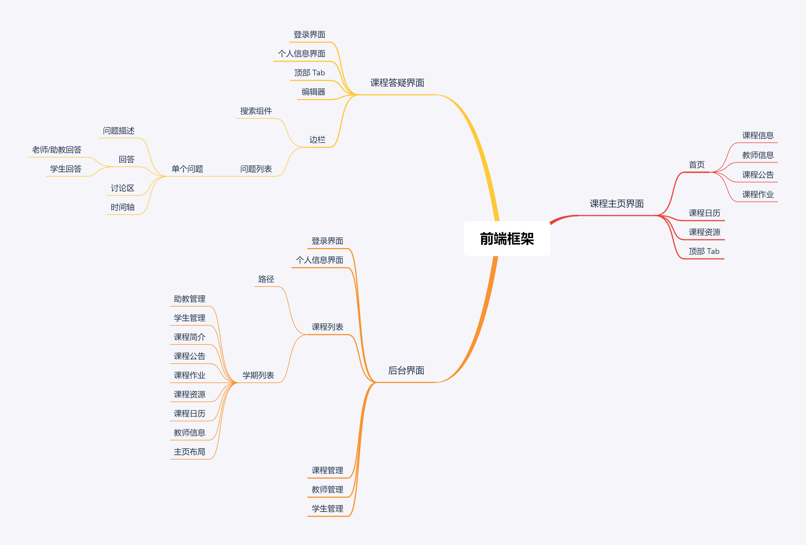

# 2020-04-14-前端框架讨论

记录者：王顺洪

参与者：李缙、金哲欣、林焕承、宁雨亭、王顺洪、许世晨、张俸铭、左顺

## 课程主页界面

#### 1. 首页

+ 首页集成课程信息、教师信息、课程公告、课程作业组件

#### 2. 课程日历

#### 3. 课程资源

#### 4. 顶部 Tab

+ 负责以上组件的导航以及对于答疑平台和过往学期的跳转
+ 过往学期使用下拉菜单实现

## 课程答疑界面

#### 1. 登录界面

#### 2. 个人信息界面

#### 3. 顶部 Tab

+ 相当于文件夹目录形式将相关问题分区（问题的位置由发布者决定）

#### 4. 编辑器

+ 对于问题描述、回答、讨论区等部分均可复用

#### 5. 边栏

1. 搜索组件
   + 负责实现对问题标题或 tag 的搜索
2. 问题列表
   + 以列表形式展示各个问题

#### 6. 单个问题

1. 问题描述

2. 回答

   对于老师/助教回答和学生回答只需有略微差别，基本可复用

3. 讨论区

4. 时间轴

   采用时间顺序安排，执行版本回退操作将以当前时间在时间轴上创建一个新的节点，内容复制欲回退至的版本。以此解决树状记录的复杂性

## 后台管理界面

#### 1. 登录界面

#### 2.个人信息界面

#### 3.课程列表

+ 针对`老师`和`助教`
+ 选择后某一课程后在页面上方显示路径，方便跳转。如：课程列表 ---> 课程 1​

#### 4.学期列表

+ `老师`或`助教`通过课程列表选择某一课程后进入
+ 选择后某一课程后在页面上方显示路径，方便跳转。如：课程列表 ---> 课程 1 ---> 学期 1​

#### 5.某课程某学期

+ `老师`或`助教`通过学期列表选择某一学期后进入

1. 助教管理
2. 学生管理
3. 课程简介
4. 课程公告
5. 课程作业
6. 课程资源
7. 课程日历
8. 教师信息
9. 主页布局

#### 4.课程管理

+ 针对`管理员`

#### 5.教师管理

+ 针对`管理员`

#### 6.学生管理

+ 针对`管理员`

## 思维导图

